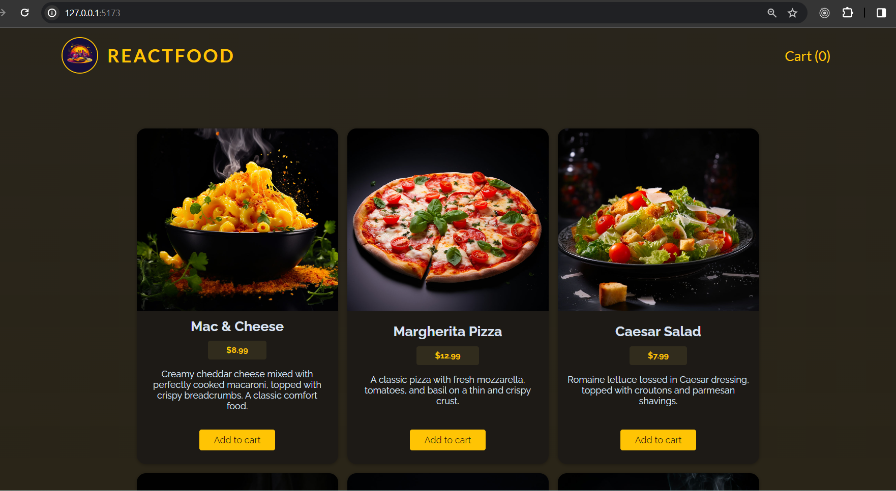

A React application with a shopping cart feature and routing using React Router. 
It covers aspects such as data fetching, component creation, context and reducer utilization, form handling, HTTP requests, and error handling. 

This application includes custom hooks, which facilitate HTTP requests within components. It employs useState, useEffect, and useCallback hooks for managing state and executing asynchronous operations.

Domain: https://food-order-kohl.vercel.app/

